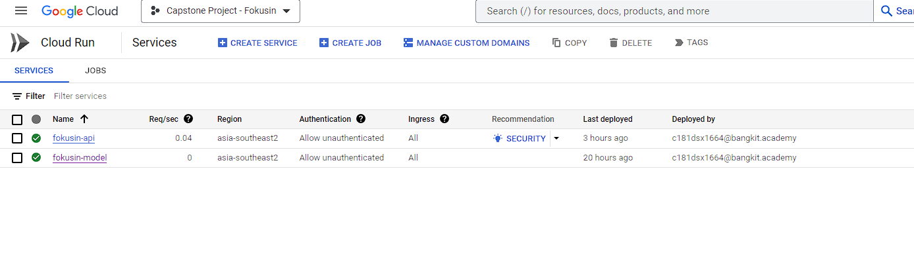
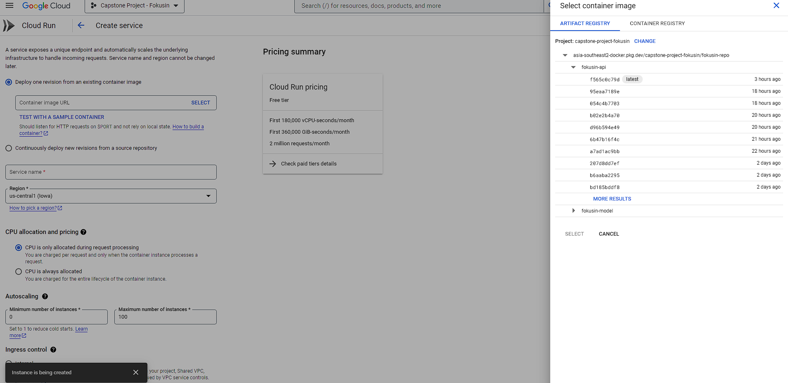
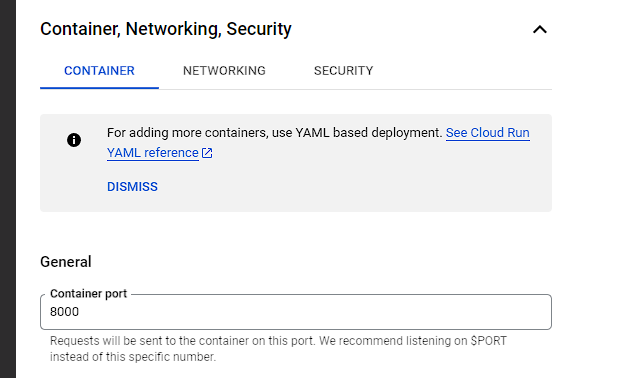

# Bangkit Capstone Project 

## FokusIn

In today’s fast-paced world, people are consuming more short-duration media which can potentially reduce their level of focus. As a result, this might affect their ability to focus during online learning and completing assignments. Our objective is to evaluate how this behavior translates to the context of modern e-learning and generate reports based on our findings.

#### Contributors
1. (ML) M169DSY1838 – Amelia Gina Salsabila
2. (ML) M169DSY1846 – Ekida Farra Salsabiila
3. (ML) M169DSX1799 – Saddam Aditya Hartanto
4. (CC) C181DSX1664 – Gregorius Bhisma 
5. (CC) C181DSY0950 – M Margaretha Stella Kalyanaduhita Tisera 
6. (MD) A251DKX3860 – Rahmat Tahmid Amiruddin

### Powered by
- Django REST Framework
- Cloud Run
- Swagger for [API Docs](https://fokusin-api-ejh5i5qlpq-et.a.run.app/swagger/).

## Development Guide

1. Create .env file with the following values
```
SECRET_KEY= "[your Django secret key]"
DEBUG = False [or True for developements]
DB_NAME = "postgres" [Name of your database]
DB_USER = "postgres" [Name of the user you want this service to connect as]
DB_PASSWORD = "[your database password]"
DB_HOST = "[your database host]"
```
2. Create a bucket to store Django's static files and media (recording images). Create a service account and download the key to the root of this project as ```django-bucket-sa.json```.
3. For local deployment, run
```shell
py -m venv env
env/Script/Activate
pip install -r requirements.txt
py manage.py collectstatic
py manage.py migrate
py manage.py runserver
```
Hit Ctrl+C to stop the server. 

## Deployment Guide
1. To deploy on GCP Cloud run, dockerize the application and push it to the Artifact Registry. Create a repository on artifact registry. 
2. Build and push the image. A ```Dockerfile``` is already provided.
```
docker build -t [your-zone]-docker.pkg.dev/[project-id]/[repo-name]/fokusin-api .
docker push [your-zone]-docker.pkg.dev/[project-id]/[repo-name]/fokusin-api
```
3. Create a cloud run service. Press create service on the Cloud Run dashboard.

4. Select the image you just pushed.

5. Expand "Container, Networking, Security". Set the Container Port to 8000. Configure other settings if needed.

6. Press create when you're ready. All traffic should be served immediately.